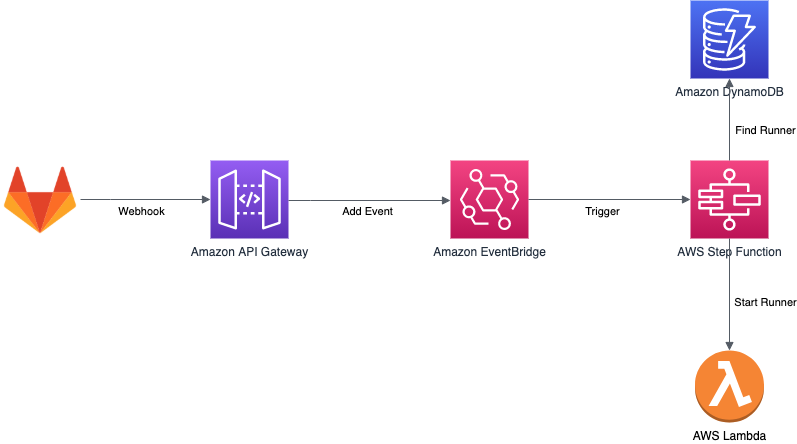

# GitLab AutoScaled Runners on AWS

Setup and run GitLab CI/CD runners on AWS in a auto scaled way using AWS Lambda. Reacts on GitLab webhooks to start Lambda functions to perform the Job in an Docker container.


## Base Architecture


## Infrastructure

The Infrastructure folder contains the base infrastructure needed to receive GitLab webhooks, using API Gateway, authenticate the calls, and add the webhook event to EventBridge. It will also setup ECR holding the Lambda Docker images.

## Auto Scaler

The AutoScaler folder contain the infrastructure, and logic, to react on GitLab wehbooks and start the appropriate Lambda function. This is accomplished by starting an express flow StepFunction using EventBridge. The Auto Scaler is depending on a DynamoDB table with a mapping between [GitLab Job name](https://docs.gitlab.com/ee/ci/jobs/) and the Lambda function to trigger for that Job. That is needed since the [GitLab API don't supply the tags as part of the response.](https://gitlab.com/gitlab-org/gitlab/-/issues/24488)

## Lambda Shell Runner

The LambdaShellRunner folder contain a Lambda function that will run a [shell executor](https://docs.gitlab.com/runner/executors/shell.html). The Docker image has the AWS CLI v2 installed.

## Limitations

Since the jobs are run inside a Docker container it's not recommended to do any Docker builds, since [running Docker in Docker is not recommended / supported.](https://docs.gitlab.com/runner/executors/docker.html#limitations)

## Installation

Deploy the base infrastructure using [SAM CLI](https://docs.aws.amazon.com/serverless-application-model/latest/developerguide/serverless-sam-cli-install.html).
When deploying the Infrastructure supply the secret that will be passed by GitLab in header _x-gitlab-token_ with the webhook.

```

cd Infrastructure
sam build
sam deploy --guided

```

Next deploy the Lambda Shell Runner, make sure Docker is installed and running.

```

cd LambdaShellRunner
sam build
sam deploy --guided

```

Finally deploy the AutoScaler, supply the name of the EventBridge eventbus used and the ARN of the default runner that should be triggered for jobs that miss a mapping in DynamoDB.

```

cd AutoScaler
sam build
sam deploy --guided

```

## Usage

Point GitLab Job Webhook to the deployed API gateway, make sure to use the same secret specified when setting up the Infrastructure.
Add job / runner mapping in the DynamoDB table, or just rely on the default runner.

Trigger you CI/CD pipelines, lean back, and enjoy.