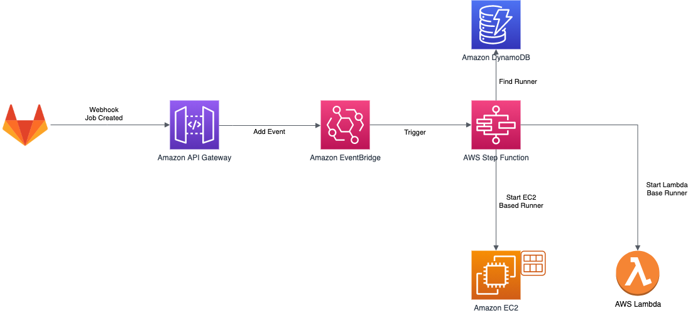
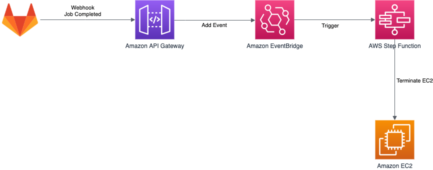

# GitLab AutoScaled Runners on AWS

Setup and run GitLab CI/CD runners on AWS in a auto scaled way using AWS Lambda. Reacts on GitLab webhooks to start Lambda functions to perform the Job in an Docker container.


## Base Architecture

### Create new runner and execute job



### Terminate runner after job completes



## Infrastructure

The Infrastructure folder contains the base infrastructure needed to receive GitLab webhooks, using API Gateway, authenticate the calls, and add the webhook event to EventBridge. It will also setup ECR holding the Lambda Docker images, and a VPC for EC2 based runners.

## Auto Scaler

The AutoScaler folder contain the infrastructure, and logic, to react on GitLab wehbooks and start the appropriate Lambda function or start a new EC2 instance. This is accomplished by starting an express flow StepFunction using EventBridge. The Auto Scaler is depending on a DynamoDB table with a mapping between [GitLab Job name](https://docs.gitlab.com/ee/ci/jobs/) and the Lambda function to trigger, or EC2 instance, for that Job. That is needed since the [GitLab API don't supply the tags as part of the response.](https://gitlab.com/gitlab-org/gitlab/-/issues/24488)  
  
If the runner is based on EC2 the instance will be unregistered and terminated when the job is completed. There is no re-using of instances. This is accomplished by sending the webhook event when a job change state, to a completed state, to EventBridge. EventBridge will trigger a new starting an express flow StepFunction that will un-register and terminate the runner.

### DynamoDB table

Each job that shouldn't be handled by the set default Lambda runner need a mapping in the created DynamoDB table.  
The primary key (field pk) should be the name of the job prefixed with job#. The sort key (field sk) should be the tags prefixed with tags# and delimited with #. The type (field type) should be either EC2 or LAMBDA. If the type is LAMBDA the arn (field arn) must be present and should be the ARN of the Lambda function.  
In the folder [HelperScripts](/HelperScripts/) is a script that will update the data in DynamoDB, just fill in the json document in the same folder.

### SSM Parameters

For a more dynamic setup configuration must be available in Parameter Store. The following must be present:  
_RegistrationToken_ This is the GitLab runner registration token.  
_Url_ This is the url to the GitLab servers  
  
The full path, e.g /gitlabrunner/RegistrationToken is configured using environment variables / parameters in the CloudFormation template.

## Lambda Shell Runner

The LambdaShellRunner folder contain a Lambda function that will run a [shell executor](https://docs.gitlab.com/runner/executors/shell.html). The Docker image has the AWS CLI v2 installed.
Don't forget to update the REGISTRATION_TOKEN in start.sh file to your own token.

## EC2 Runner

Since it's not recommended not to run Docker in Docker, also not supported by GitLab runners, there is a need for a EC2 based runner for these kinds of jobs. For the auto scaling to be fast and to work properly a AMI should be pre-baked. There are some requirements on software that need to be installed on the EC2 instance. See [ami-preparation.md](ami-preparation) for details.

## Limitations

Since the jobs are run inside a Docker container it's not recommended to do any Docker builds, since [running Docker in Docker is not recommended / supported.](https://docs.gitlab.com/runner/executors/docker.html#limitations)

## Installation

Deploy the base infrastructure using [SAM CLI](https://docs.aws.amazon.com/serverless-application-model/latest/developerguide/serverless-sam-cli-install.html).
When deploying the Infrastructure supply the secret that will be passed by GitLab in header _x-gitlab-token_ with the webhook.

```

cd Infrastructure
sam build
sam deploy --guided

```

Next deploy the Lambda Shell Runner, make sure Docker is installed and running.

```

cd LambdaShellRunner
sam build
sam deploy --guided

```

Finally deploy the AutoScaler, supply the name of the EventBridge eventbus used and the ARN of the default runner that should be triggered for jobs that miss a mapping in DynamoDB.

```

cd AutoScaler
sam build
sam deploy --guided

```

## Usage

Point GitLab Job Webhook to the deployed API gateway, make sure to use the same secret specified when setting up the Infrastructure.
Add job / runner mapping in the DynamoDB table, or just rely on the default runner.

Trigger you CI/CD pipelines, lean back, and enjoy.